# Entity-Relationship Diagram (ERD) — Hotel Management System (Phase 2)

**Phiên bản:** 2.0 | **Framework:** Laravel 12 + MySQL  
**Tổng số bảng:** ~50 tables | **Foreign Keys:** ~80+ | **Audit Columns:** Applied to ~40 tables

**Quy ước:** Mọi bảng nghiệp vụ có `id` (primary key), `created_at`, `updated_at`, `deleted_at` (soft delete), `created_by`, `updated_by` (audit columns via `HasAuditColumns` trait).

---

## 1. Tổng quan kiến trúc dữ liệu

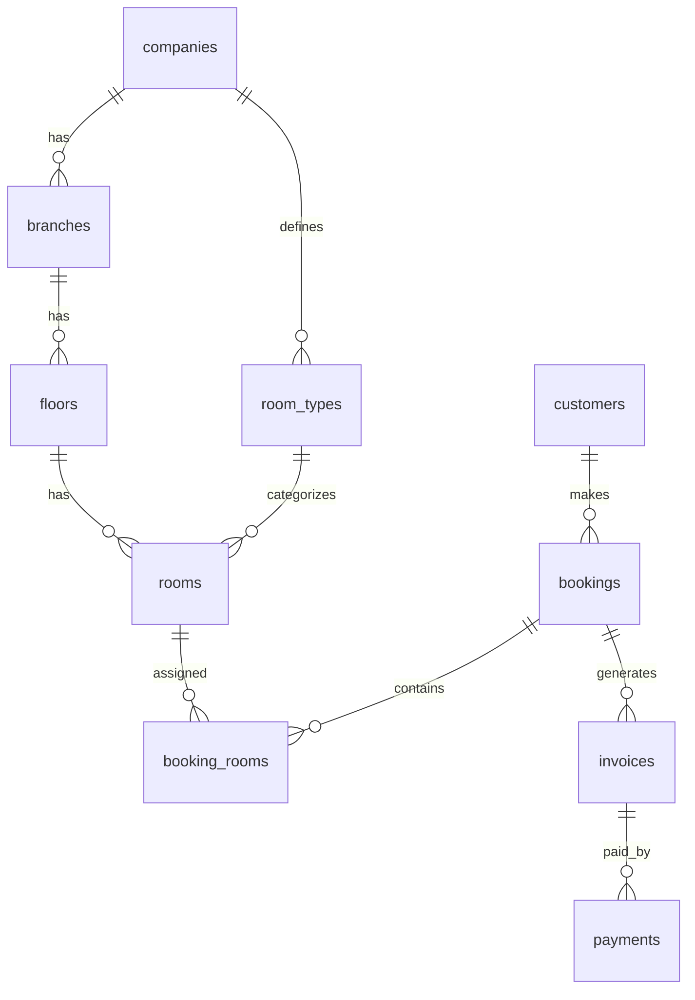

---

## 2. System & Auth

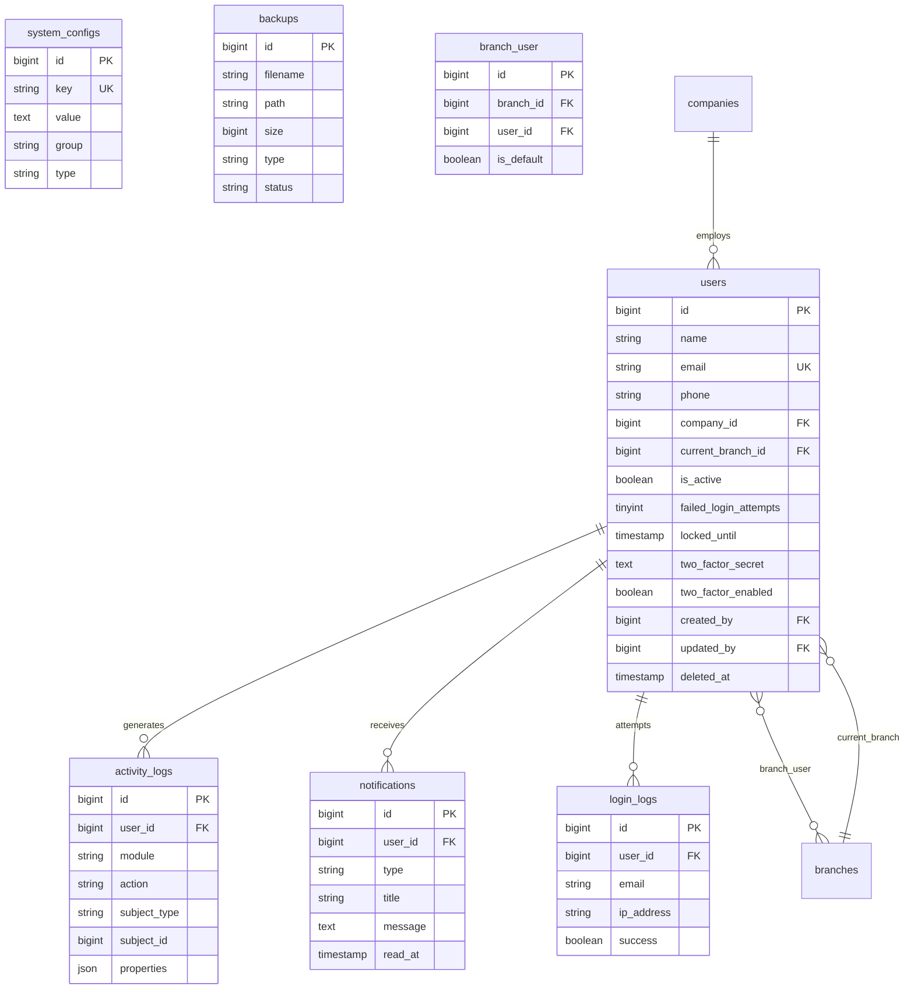

---

## 3. Enterprise

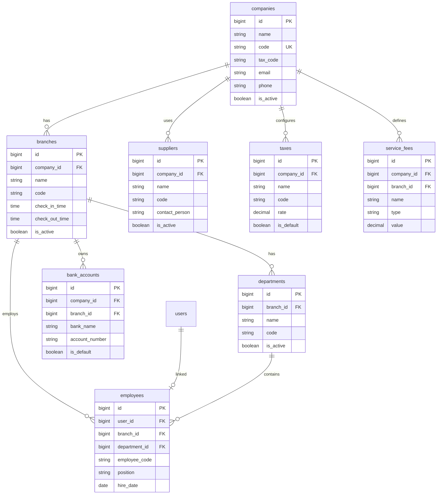

---

## 4. Room Management

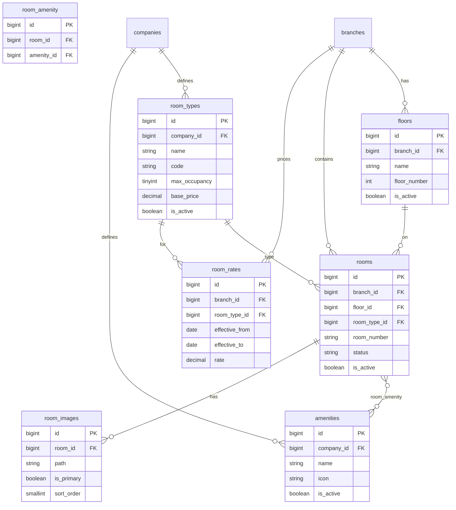

**Room status enum:** `available`, `occupied`, `reserved`, `maintenance`, `cleaning`

---

## 5. Customer & Loyalty

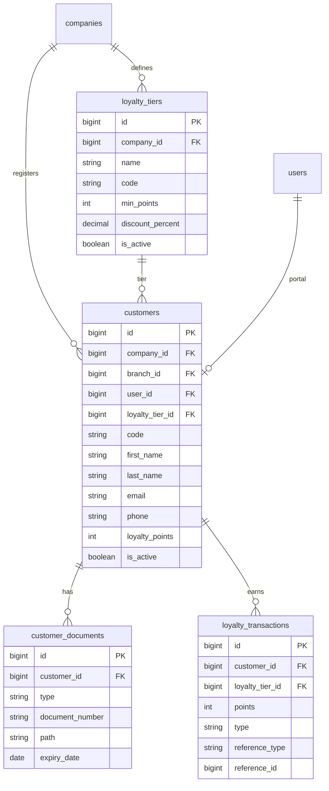

---

## 6. Services

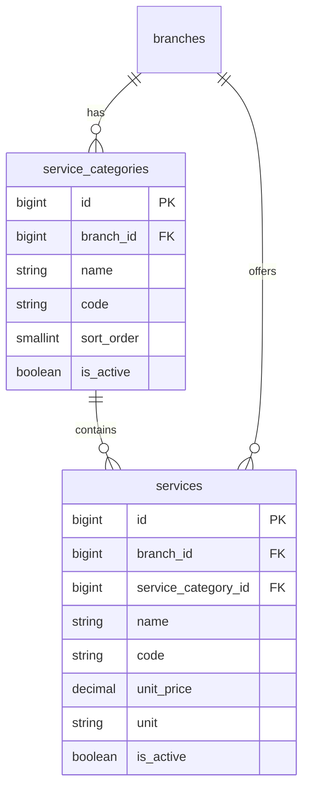

---

## 7. Booking (Core)

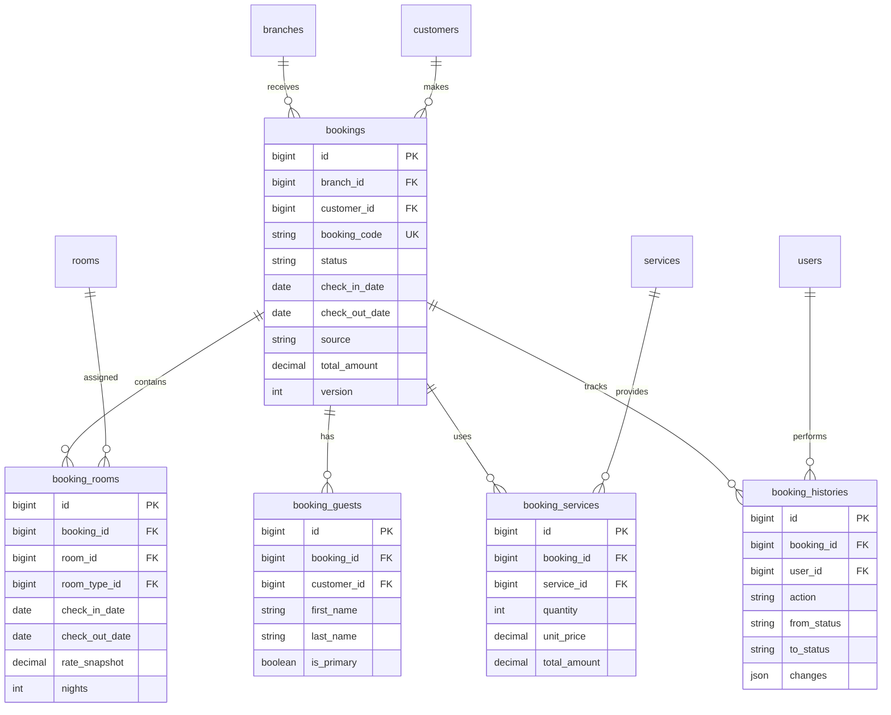

**Booking status enum:** `pending`, `confirmed`, `checked_in`, `checked_out`, `cancelled`, `no_show`

**Indexes:** `bookings(branch_id, status)`, `booking_rooms(room_id)`, `booking_rooms(room_id, check_in_date, check_out_date)`

---

## 8. Payment & Invoice

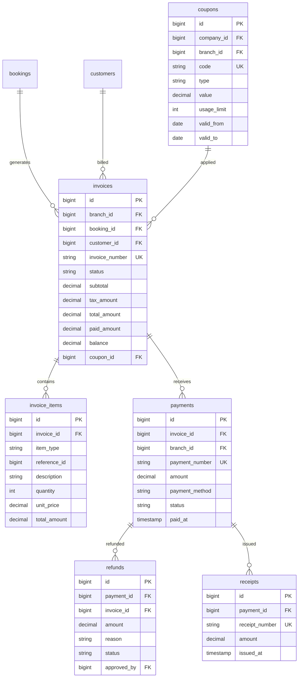

**Invoice status enum:** `draft`, `issued`, `partial`, `paid`, `cancelled`, `refunded`  
**Payment method enum:** `cash`, `bank`, `momo`, `vnpay`, `qr`

---

## 9. Pricing & Luggage

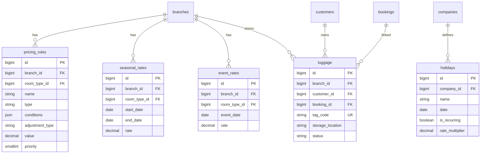

---

## 10. Inventory, Maintenance & Contracts

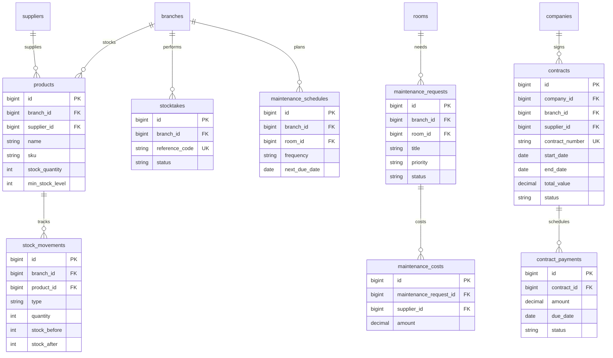

---

## 11. Integration & RBAC (Spatie)

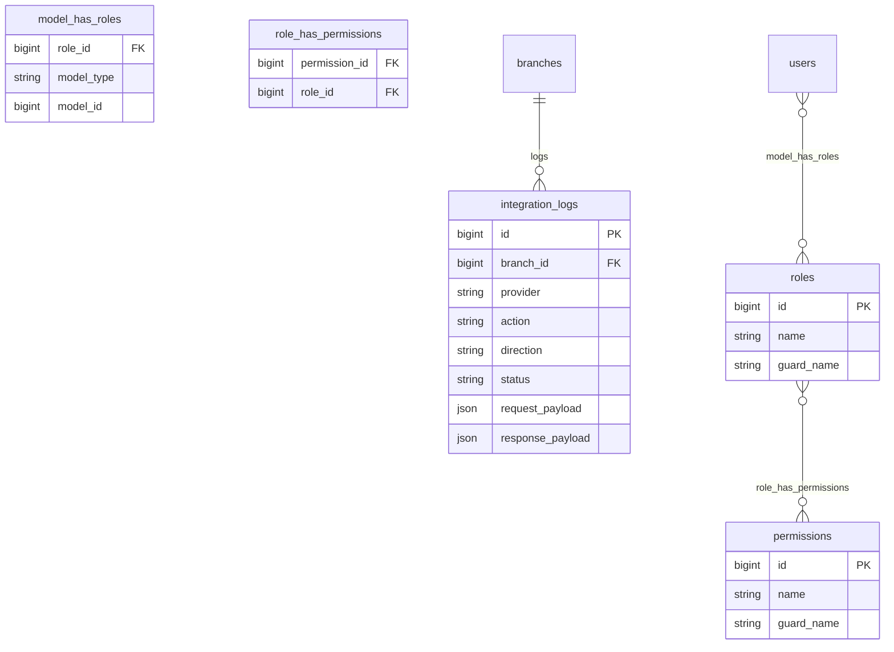

**6 Roles:** `super_admin`, `company_admin`, `hotel_manager`, `receptionist`, `staff`, `customer`  
**15 Modules × 8 Actions:** `{module}.{view|create|update|delete|approve|export|import|print}`

---

## 12. Migration Order

| # | File | Tables |
|---|------|--------|
| 100000 | extend_users_and_create_system_tables | users*, system_configs, activity_logs, notifications, login_logs, backups |
| 100001 | create_enterprise_tables | companies, branches, departments, employees, suppliers, bank_accounts, taxes, service_fees |
| 100002 | create_room_tables | room_types, amenities, floors, rooms, room_amenity, room_images, room_rates |
| 100003 | create_customer_tables | loyalty_tiers, customers, customer_documents, loyalty_transactions |
| 100004 | create_service_tables | service_categories, services |
| 100005 | create_booking_tables | bookings, booking_rooms, booking_guests, booking_services, booking_histories |
| 100006 | create_payment_tables | coupons, invoices, invoice_items, payments, refunds, receipts |
| 100007 | create_luggage_and_pricing_tables | luggage, pricing_rules, seasonal_rates, event_rates, holidays |
| 100008 | create_inventory_maintenance_contract_tables | products, stock_movements, stocktakes, maintenance_*, contracts, contract_payments |
| 100009 | create_integration_and_branch_user_tables | integration_logs, branch_user |

---

**Tài liệu liên quan:** [01-requirements-analysis.md](../phase-1/01-requirements-analysis.md) | [03-functional-specification.md](../phase-1/03-functional-specification.md)
