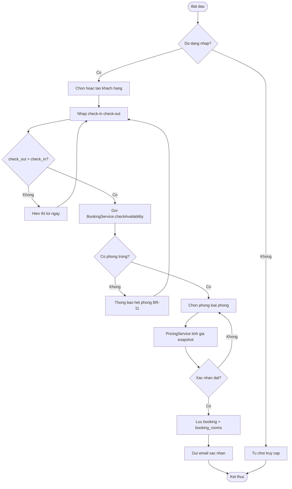
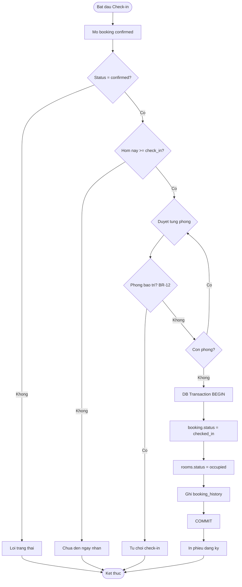
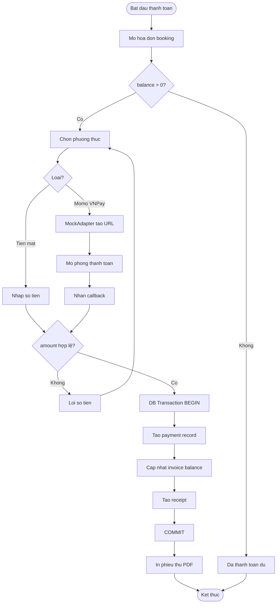
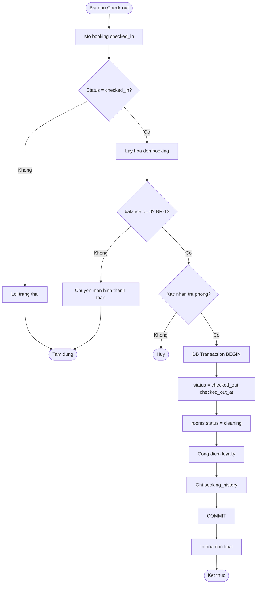

# Activity Diagram — Tạo Booking & Check Availability

**Use Case:** UC-BOOK-01, UC-BOOK-03

---

# Activity Diagram — Check-in

**Use Case:** UC-BOOK-04 | **Business Rules:** BR-12, BR-14

---

# Activity Diagram — Thanh toán

**Use Case:** UC-PAY-02, UC-PAY-04 | **Business Rule:** BR-15

---

# Activity Diagram — Check-out

**Use Case:** UC-BOOK-05 | **Business Rules:** BR-13, BR-16

---

**Tài liệu liên quan:**
- [02-use-case-specification.md](../../phase-1/02-use-case-specification.md)
- [03-functional-specification.md](../../phase-1/03-functional-specification.md)
