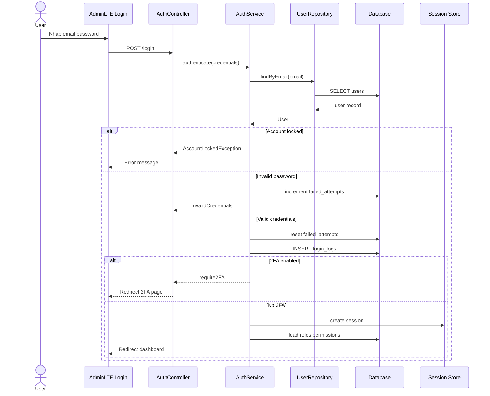
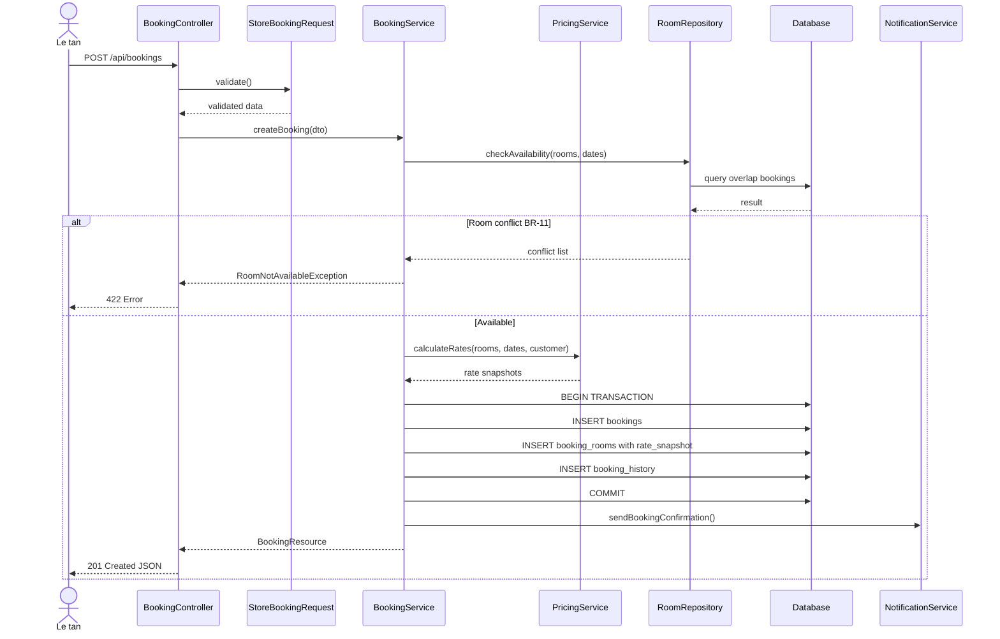
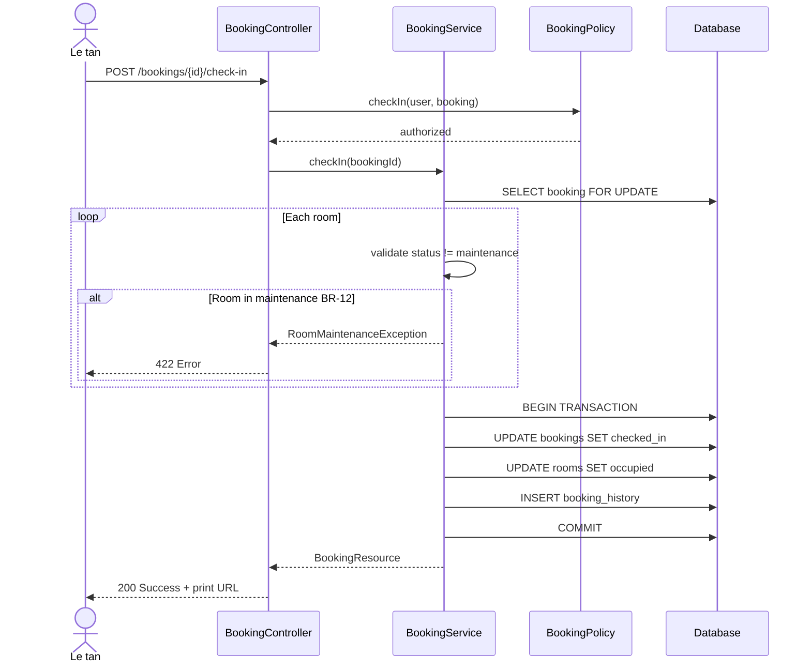
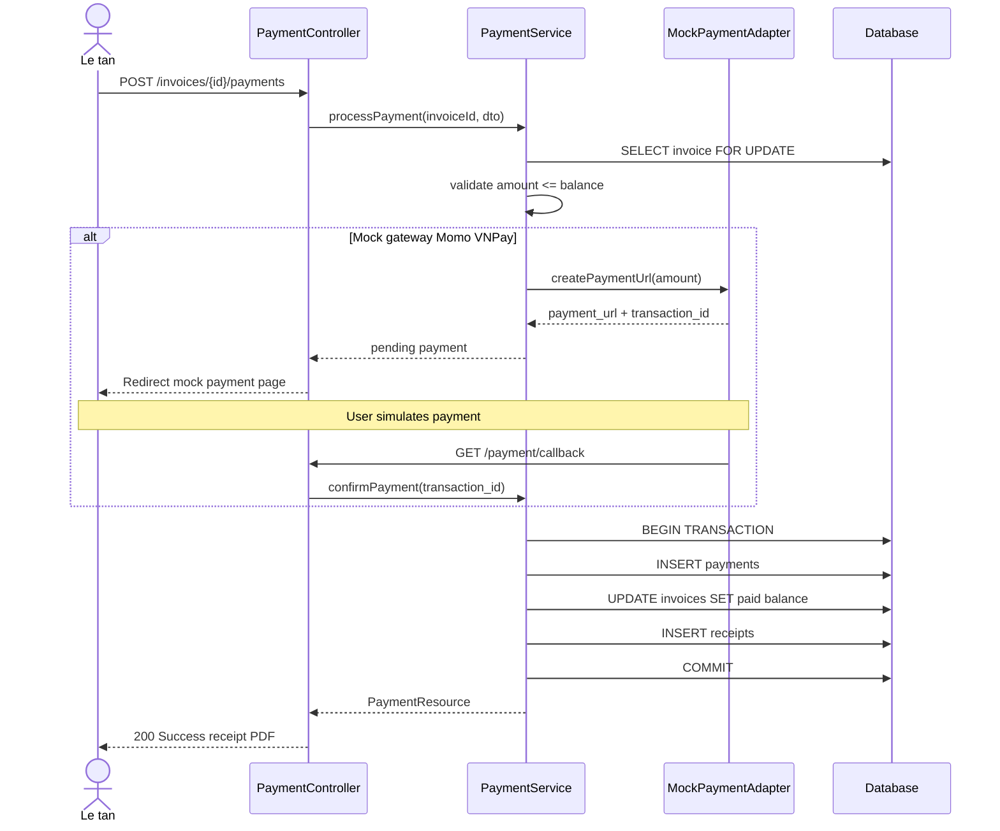

# Sequence Diagram — Login & RBAC

**Use Case:** UC-SEC-01

---

# Sequence Diagram — Tạo Booking

**Use Case:** UC-BOOK-01, UC-BOOK-03

---

# Sequence Diagram — Check-in (Transaction)

**Use Case:** UC-BOOK-04 | **Rules:** BR-12, BR-14

---

# Sequence Diagram — Thanh toán (Transaction)

**Use Case:** UC-PAY-02, UC-PAY-04 | **Rule:** BR-15

---

**Tài liệu liên quan:**
- [core-flows.md](../activity-diagrams/core-flows.md)
- [03-functional-specification.md](../../phase-1/03-functional-specification.md)
