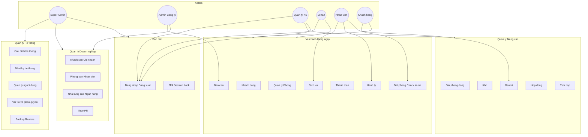
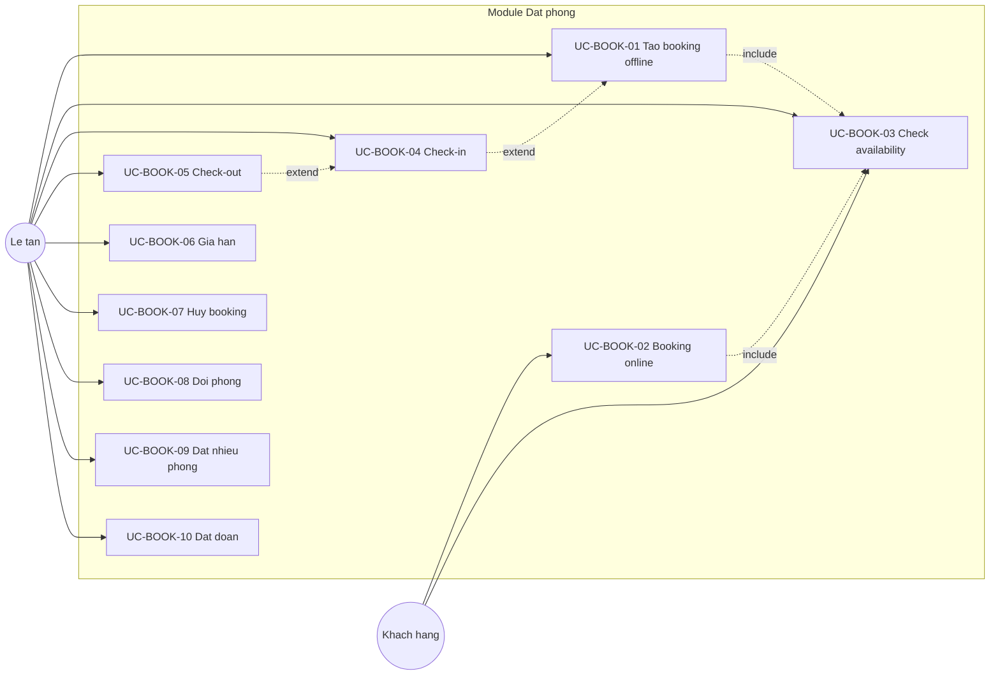
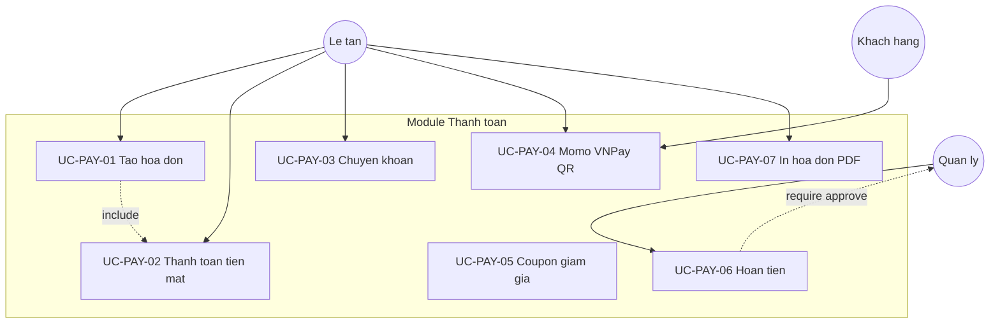

# Use Case Diagram — Hotel Management System

**Notation:** Mermaid (có thể render trong GitHub, VS Code, hoặc export PNG)

---

## 1. Tổng quan hệ thống

---

## 2. Module Booking — Use Cases

---

## 3. Module Payment — Use Cases

---

## 4. Phân quyền Actor — Ma trận

| Module | SA | AC | QL | LT | NV | KH |
|--------|:--:|:--:|:--:|:--:|:--:|:--:|
| Hệ thống | ✓ | ◐ | ✗ | ✗ | ✗ | ✗ |
| Doanh nghiệp | ✓ | ✓ | ◐ | ✗ | ✗ | ✗ |
| Phòng | ✓ | ◐ | ✓ | ✓ | ◐ | ✗ |
| Khách hàng | ✓ | ◐ | ✓ | ✓ | ✗ | ◐ |
| Booking | ✓ | ◐ | ✓ | ✓ | ✗ | ✓ |
| Thanh toán | ✓ | ◐ | ✓ | ✓ | ✗ | ◐ |
| Báo cáo | ✓ | ✓ | ✓ | ◐ | ✗ | ✗ |
| Giá động/Kho | ✓ | ◐ | ✓ | ✗ | ◐ | ✗ |

✓ Full | ◐ Partial | ✗ None

---

**Tài liệu liên quan:** [02-use-case-specification.md](../phase-1/02-use-case-specification.md)
